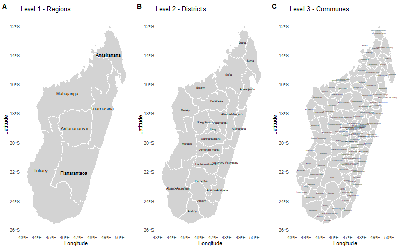
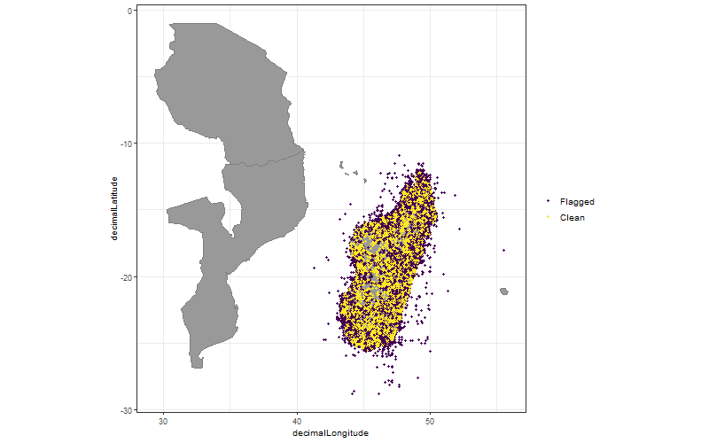
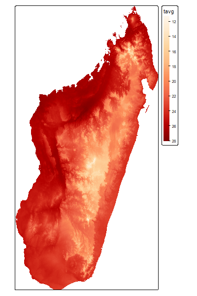
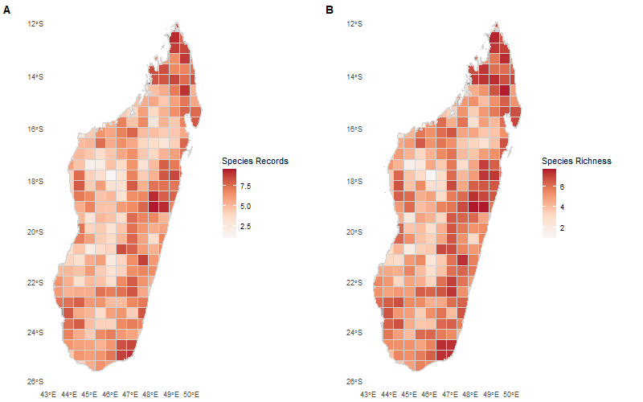
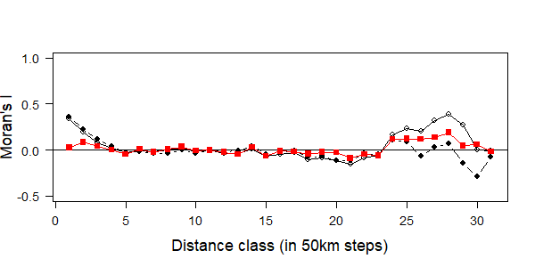

# Welcome {.unnumbered}

This book provides an introduction to the use of spatial biodiversity
data in ecological and biogeographical research.

The objectives of this book are to:

- Explain the fundamentals of spatial analyses.
- Demonstrate workflows using R.

## Intended Audience

This book is intended for:

- Students learning spatial analysis in R

## Book Structure

The book is organized into the following sections:

1.  Introduction & Background

2.  Simple Mapping

    

3.  Downloading and cleaning biodiversity occurrence data from GBIF

    

4.  Downloading environmental geodata

    {width="299"}

5.  Extracting information from spatial data

    

6.  Spatial autocorrelation

    

## How to Use This Book

Code examples are provided throughout the text. Most examples use:

- `{sf}`
- `{terra}`
- `{rgbif}`
- `{tidyverse}`
- `{ggplot2}`

Readers are encouraged to reproduce the analyses on their own datasets.

## License

Unless otherwise stated, all content is licensed under a Creative
Commons Attribution (CC BY) license.
